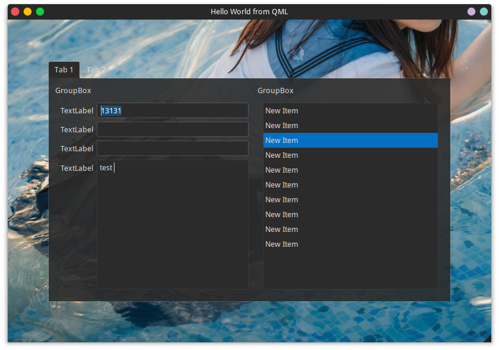

# QQuickWidgetContainer

It helps you embed Qt widgets into QML.

## Limitations and Disclaimer

This is a proof-concept of bridging QWidget-based window system and QtQuick, focusing, opacity, z-value and many
other properties are not supported.

## Screenshot

## Credit

- [ShowQwidgetinQMLdemo](https://github.com/CLP0037/qml_test/blob/master/testQwidgetinQML/ShowQwidgetinQMLdemo/main.cpp#L85)
- [background.jpg](https://twitter.com/Rakukoooo/status/1216554722183852037)

## LICENSE

GPLv3, except the demo backgroud image
